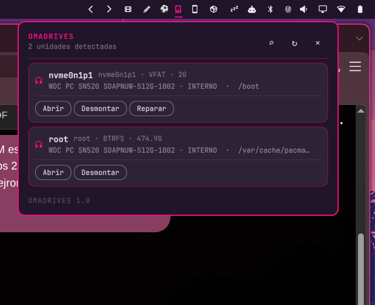

# OmaDrives

OmaDrives puts your drives in the Omarchy bar. Click a drive to mount it, open it, repair supported filesystem errors, or eject it safely — without opening a terminal.



## What it does

- Detects mounted and unmounted filesystem partitions.
- Mounts writable volumes through `udisksctl`.
- Opens mounted volumes in the desktop file manager.
- Unmounts partitions cleanly.
- Safely ejects removable disks by unmounting and powering them off.
- Repairs supported filesystem issues through a polkit prompt:
  - NTFS (`ntfsfix`)
  - FAT/VFAT (`fsck.fat`)
  - exFAT (`fsck.exfat`)
  - ext2/ext3/ext4 (`fsck.*`)
- Re-scans hardware when a drive does not appear.
- Shows filesystem type, mount state, model, size, and mount path.
- Adapts interface labels to the system locale while keeping the product documentation in English.

## Safety by design

- Repair and eject require an explicit confirmation step.
- The widget never formats a disk.
- It does not implement destructive file deletion; use the file manager after opening a mounted volume. That keeps deletion in the tool designed for browsing, trash, undo, and permissions.
- Virtual devices such as zram, loop devices, and md arrays are hidden.
- Unsupported filesystem types do not get a fake Repair action.
- No credentials are stored.

## Install

Clone or download this repository into the Omarchy local plugin directory:

```bash
mkdir -p ~/.config/omarchy/plugins/io.github.brm-src.omadrives
git clone https://github.com/brm-src/omadrives.git ~/.config/omarchy/plugins/io.github.brm-src.omadrives
omarchy-shell shell rescanPlugins
```

Add `io.github.brm-src.omadrives` to a bar section through Omarchy's plugin configuration. Restart the shell if an already-running bar does not pick up the new entry point.

## Remove

Remove the plugin directory and remove its ID from your bar layout:

```bash
rm -rf ~/.config/omarchy/plugins/io.github.brm-src.omadrives
omarchy-shell shell rescanPlugins
```

Removing the plugin does not delete files from any drive.

## Controls

- Left click: open or close the drive panel.
- `R`: refresh the device list.
- The magnifier action: ask the kernel to rescan storage hosts.
- Mount / Open / Unmount / Eject / Repair: operate on the selected partition.
- `Esc`: close the panel.

## Requirements

- Omarchy / Quickshell with the `qs.Commons` and `qs.Ui` imports.
- `udisks2` and `udisksctl`.
- `findmnt` and `lsblk`.
- Optional filesystem repair tools for the Repair action.
- `polkit`/`pkexec` for privileged repair and hardware rescan operations.

The widget asks for authorization only when an operation genuinely needs it. It does not store the password.

## Development checks

```bash
python3 -m unittest discover -s tests -q
python3 -m py_compile omadrives.py
qmllint -I /usr/share/omarchy/shell main.qml Panel.qml
omarchy plugin validate .
git diff --check
```

## License

MIT.
